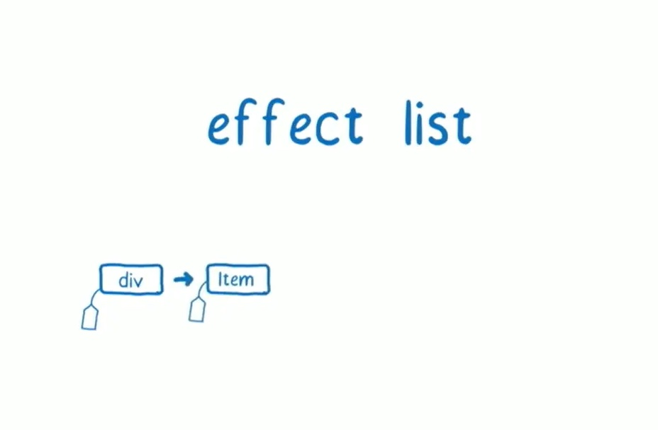
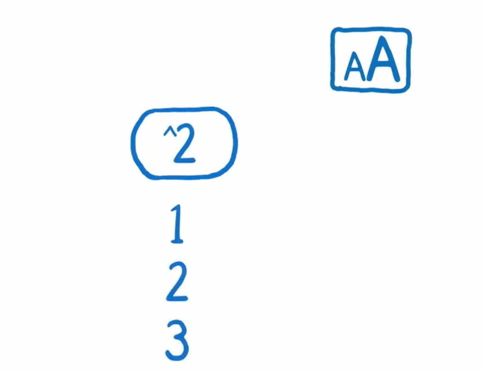

# React v16 生命周期浅入"深出"

[react 官网 声明周期介绍](https://zh-hans.reactjs.org/docs/react-component.html#the-component-lifecycle)

## React 目录结构

### 顶层目录

React 采用 [monorepo](https://juejin.im/entry/586f00bc128fe100580a6f78) 的管理方式。仓库中包含多个独立的包，以便于更改可以一起联调，并且问题只会出现在同一地方。

- packages 包含元数据（比如 package.json）和 React 仓库中所有 package 的源码（子目录 src）。如果你需要修改源代码, 那么每个包的 src 子目录是你最需要花费精力的地方。
- fixtures 包含一些给贡献者准备的小型 React 测试项目。
- build 是 React 的输出目录。源码仓库中并没有这个目录，但是它会在你克隆 React 并且第一次构建它之后出现。
- 还有一些其他的顶层目录，但是它们几乎都是工具类的，并且在贡献代码时基本不会涉及。

### packages

- react、react-dom 就不说了
- react-reconciler 是 16.x 中新实现的 fiber reconciler 的核心代码
- scheduler 是 react 调度模块的核心代码，之前是放在 react-reconciler 中的，后来独立了出来
- events 是和 react 事件相关的代码
- shared 是不同 packages 公用的一些代码
- 其它 packages 我们这里不做探讨

## 核心概念

### 核心模块

React “Core” 中包含所有全局 React API，比如：

- React.createElement()
- React.Component
- React.Children

React 核心只包含定义组件必要的 API。它不包含协调算法或者其他平台特定的代码。它同时适用于 React DOM 和 React Native 组件。React 核心代码在源码的 `packages/react` 目录中。在 npm 上发布为 react 包。相应的独立浏览器构建版本称为 react.js，它会导出一个称为 React 的全局对象。

### 渲染器

React 最初只是服务于 DOM，但是这之后被改编成也能同时支持原生平台的 React Native。因此，在 React 内部机制中引入了“渲染器”这个概念。

**渲染器用于管理一棵 React 树，使其根据底层平台进行不同的调用。**

渲染器同样位于 `packages/` 目录下：

- React DOM Renderer 将 React 组件渲染成 DOM。它实现了全局 ReactDOMAPI，这在npm上作为 react-dom 包。这也可以作为单独浏览器版本使用，称为 react-dom.js，导出一个 ReactDOM 的全局对象.
- React Native Renderer 将 React 组件渲染为 Native 视图。此渲染器在 React Native 内部使用。
- React Test Renderer 将 React 组件渲染为 JSON 树。这用于 Jest 的快照测试特性。在 npm 上作为 react-test-renderer 包发布。

### reconciler(协调/调解 器)

即便 React DOM 和 React Native 渲染器的区别很大，但也需要共享一些逻辑。特别是协调算法需要尽可能相似，这样可以让声明式渲染，自定义组件，state，生命周期方法和 refs 等特性，保持跨平台工作一致。

为了解决这个问题，不同的渲染器彼此共享一些代码。我们称 React 的这一部分为 “reconciler”。当处理类似于 setState() 这样的更新时，reconciler 会调用树中组件上的 render()，然后决定是否进行挂载，更新或是卸载操作。

Reconciler 没有单独的包，因为他们暂时没有公共 API。相反，它们被如 React DOM 和 React Native 的渲染器排除在外。
这部分源码在 `/packages/react-reconciler`。

### scheduler

在 react 中从产生更新到最终操作DOM这之间可以叫做 reconciliation（协调）的过程，其实这中间还可以再进行细分，其中产生的更新会放在一个更新队列里，如何调度这些更新让它们进行下一步任务这个部分叫做 scheduler，而 react 采用叫做 [Cooperative Scheduling （合作式调度）](https://www.w3.org/TR/requestidlecallback/) 的方式来调度任务，简单来说就是充分利用浏览器的空闲时间来执行任务，有空闲时间就执行对应的任务，没有就把执行权交给浏览器，在浏览器中就是通过 [requestIdleCallback](https://developer.mozilla.org/zh-CN/docs/Web/API/Window/requestIdleCallback) 这个 API 来实现的，但是因为这个 API 存在的一些问题以及浏览器的兼容性问题，所以 react 通过 [requestAnimationFrame](https://developer.mozilla.org/zh-CN/docs/Web/API/Window/requestAnimationFrame)、setTimeout 和 MessageChannel 来模拟了 requestIdleCallback 的行为。现在 react 把这部分代码单独拎出来作为一个 package。这部分源码在 /packages/scheduler 中。

### 事件系统

react 自己实现了一套事件系统，和原生的 DOM 事件系统相比减少了内存消耗，抹平了浏览器差异，那么 react 是如何做到的呢，主要是采用了以下策略：

- 采用事件委托的方式将事件都注册在 document 对象上
- react 内部创建了一个自己的事件对象 SyntheticEvent （合成事件），将原生事件进行了封装，我们在 react 中操纵的实际上是这个封装的对象
- react 内部通过对象池的形式来创建和销毁事件对象

这部分的源码在` /packages/events` 中。

### 声明周期

react 模块正如上面介绍的那些，而生命周期仅仅只是 reconciler、scheduler 模块 调用的 命名为声明周期的函数而已，所以我们要深挖 声明周期的原理，其实 就是挖掘 reconciler 的内部实现，声明周期的每个函数 的功能特性 适用性 局限性 都是由 reconciler 决定。下面在深挖 reconciler 前 我们先来对比 react15 与 react16在 reconciler 实现上的差异

## 生命周期的调用者-Reconciler

> 概念：按照我的理解就是 更新 -> DOM 变化 这之间的流程，它包括了diff 算法。

react有两套协调算法：stack reconciler(react@15.x) 和 fiber reconciler(react@16.x)

### stack reconciler

> 概念: 在 react 16 之前的调度算法被称作 stack reconciler，它的特点是自顶向下的更新方式，比如调用 this.setState() 之后的流程就像这样：this.setState() => 生成虚拟 DOM => diff 算法比较 => 找到要更新的元素 => 放到更新队列里

问题:

在 stack reconciler 里面更新时同步的，自顶向下的更新方式，只要更新过程开始就会“一条道走到黑”直到所有节点的比对全部完成，这样的方式如果节点数量比较少还好，如果想上面这种情况节点数量很多，假设有 200 个节点，每个节点进行 diff 算法需要 1ms，那么全部比对完就需要 200ms，也就是说在这 200ms 里面浏览器无法处理其它任务，比如无法渲染视图，一般 30 帧及以上会让人感到流畅，那每帧就需要 33.3ms，显然 200ms > 33.3ms，所以相当于因为 JS 的长时间执行导致帧率变得很低，等到 200ms 之后浏览器将之前漏掉的页面渲染一下子呈现的时候你就会感觉到不连贯也就是卡顿了。

这里需要补充一下关于浏览器帧的概念

我们知道要实现流畅的显示效果，刷新频率（FPS）就不能太低，现代浏览器一般的刷新频率是 60FPS，所以每一帧分到的时间是 1000/60 ≈ 16 ms，在这 16 ms 中浏览器会安排如下事项

- 处理用户的交互
- JS 解析执行
- 帧开始。窗口尺寸变更，页面滚去等的处理
- rAF(requestAnimationFrame)
- 布局
- 绘制

可以看到浏览器这一帧里面要做的事情着实不少，如果 js 引擎的执行占用的时间过长那势必导致其它任务的执行（比如响应用户交互）要延后，这也就是导致卡顿的原因。

### Fiber reconciler

> 概念: react 16 版本对以前的 stack reconciler 进行了一次重写，就是 fiber reconciler，它的目的是为了解决 stack reconciler 中固有的问题，同时解决一些历史遗留问题。

**期望的是能够实现如下目标：**

- 能够把可中断的任务切片处理
- 能够调整优先级，重置并复用任务
- 能够在父元素与子元素之间交错处理，以支持 React 中的布局
- 能够在 render() 中返回多个元素
- 更好地支持错误边界

要实现这些特性一个很重要的点就是：切片，把一个很大的任务拆分成很多小任务，每个小任务做完之后看看是否需要让位于其它优先级更高的任务，这样就能保证这个唯一的线程不会被一直占用，我们把每一个切片（小任务）就叫做一个 fiber。

在何时进行切片？

react 的整个执行流程分为两个大的阶段:

- Phase1: render/reconciliation
- Phase2: commit

第一个阶段负责产生 Virtual DOM -> diff 算法 ->  产生要执行的 update，第二个阶段负责将更新渲染到 DOM Tree 上，如果我们在第二个阶段进行分片肯能会导致页面显示的不连贯，会影响用户体验，所以将其放在第一个阶段去分片更为合理。

**切出来的是什么呢？**

切片出来就是 fiber 对象，fiber 翻译为纤维，在计算机科学中叫协程或纤程，一种比线程耕细粒度的任务单元，虽然 JS 原生并没有该机制（大概），但是我想 react 大概是想借用该思想来实现更精细的操控任务的执行吧。

**如何调度任务执行？**

`React` 通过两个 JS 底层 api 来实现：

- `requestIdleCallback` 该方法接收一个 `callback` ，这个回调函数将在浏览器空闲的时候调用
- `requestAnimationFrame` 该方法接收一个 `callback` ，调用 `requestAnimationFrame` ，会将 `callback` 调用推入 animation frame request callback list，而一个非空的 animation frame request callback list，将会使浏览器周期性的向 event loop 中添加一个任务去执行 requestAnimationFrame 注册的回调，这里的周期推测和 event loop 中的渲染时机（rendering opportunity）有关。

其中 `requestIdleCallback` 兼容新不是很好，react 用 `setTimeout` 和 `MessageChannel 来模拟了` `requestIdleCallback` 的行为
它俩的区别是 `requestIdleCallback` 是需要等待浏览器空闲的时候才会执行而 `requestAnimationFrame` 是每帧都会执行，所以高优先级的任务交给 `requestAnimationFrame` 低优先级的任务交给 `requestIdleCallback` `去处理，但是为了避免因为浏览器一直被占用导致低优先级任务一直无法执行，requestIdleCallback` 还提供了一个 `timeout` 参数指定超过该事件就强制执行回调。

## 实现

接下来我们来通过一个例子看看 fiber reconciler 是如何实现的，不过在此之前我们先来认识一些 react 源码中的名词。

### 名词解释

`Fiber`

上面我们提到了 Fiber，它表示 react 中最小的一个工作单元， 在 react 中 ClassComponent，FunctionComponent，普通 DOM 节点，文本节点都对应一个 Fiber 对象，Fiber 对象的本质其实就是一个 Javascript 对象。

`child`

child 是 Fiber 对象上的属性，指向的是它的子节点（Fiber）

`sibling`

sibling 是 Fiber 对象上的属性，指向的是它的兄弟节点（Fiber）

`return`

return 是 Fiber 对象上的属性，指向的是它的父节点（Fiber）

`stateNode`

stateNode 是 Fiber 对象上的属性，表示的是 Fiber 对象对应的实例对象，比如 Class 实例、DOM 节点等

`current`

current 表示已经完成更新的 Fiber 对象

`workInProgress`

workInProgress 表示正在更新的 Fiber 对象

`alternate`

alternate 用来指向 current 或 workInProgress，current 的 alternate 指向 workInProgress，而 workInProgress 的 alternate 指向 current

`FiberRoot`

FiberRoot 表示整个应用的起点，它内部保存着 container 信息，对应的 fiber 对象（RootFiber）等

`RootFiber` (HostRoot)

RootFiber 表示整个 fiber tree 的根节点，它内部的 stateNode 指向 FiberRoot，它的 return 为  null

### Fiber tree

> 我们这里要注意的是 fiber tree 不同于传统的 Virtual DOM 是树形结构，fiber 的 child 只指向第一个 子节点，但是可以通过 sibling 找到其兄弟节点，所以整个结构看起来更像是一个链表结构。

### 举个例子

我们有这样一个 App 组件，它包含一个 button 和一个 List 组件，当点击 button 的时候 List 组件内的数字会进行平方运算，另外在 App 组件外还有一个 button，它不是用 react 创建的，它的作用是点击时会放大字体。

### 挂载阶段

第一次渲染阶段也就是挂载阶段，react 会自上而下的创建整个 fiber tree，创建顺序是同 FiberRoot 开始，通过一个叫做 work loop 的循环来不断创建 fiber 节点，循环会先遍历子节点（child），当没有子节点再遍历兄弟节点（sibling），最终达到全部创建的目的，以我们的 demo 为例，fiber 的创建顺序如下图箭头所示。

构建好的 fiber tree 如下图所示

### 更新阶段

这时，我们通过点击【^2】按钮来产生一个更新，产生的更新会放入 List 组件的更新队列里（update queue），在 fiber reconciler 中异步的更新并不会立即处理，它会执行调度（schedule）程序，让调度程序判断什么时候让它执行，调度程序就是通过上面所说的 requestIdleCallback 来判断何时处理更新。

当主进程把控制权交给我们的时候我们就可以开始执行更新了，我们把这个阶段叫做 work loop，work loop 是一个循环，它循环的去执行下一个任务，在执行之前要先判断剩余的时间是否够用，所以对于 work loop 它要追踪两个东西：下一个工作单元和剩余时间。

目前我的剩余时间是 13ms，下一个要执行的任务是 HostRoot，这里需要注意通过 this.setState 产生的更新也会先从根节点开始遍历，react 会通过产生更新的那个 fiber 对象（List）向上找到对应的 HostRoot。

react 会保留之前生成的 fiber tree 我们管它叫 current fiber tree，然后新生成一个 workInProgress tree，它用来计算出产生的变化，执行 reconciliation 的过程，HostRoot 可以直接通过克隆旧的 HostRoot 产生，此时新的 HostRoot 的 child 还指向老的 List 节点。

当 HostRoot 处理完成之后就会向下寻找它的子节点也就是 List，所以下一个任务就是 List，我们同样可以克隆之前的 List 节点，克隆好之后 react 会判断一下是否还有剩余的时间，发现还有剩余的时间，那么开始执行 List 节点的更新任务。

当我们执行 List 的更新时我们发现 List 的 update queue 里面有 update，所以 react 要处理该更新

当我们处理完 update queue 之后会判断 List 节点上面是否有 effect 要处理，比如 componentDidUpdate ，getSnapshotBeforeUpdate。

因为 List 产生了新的 state，所以 react 会调用它的 render 方法返回新的 VDOM，接下来就用到了 diff 算法了，根据新旧节点的类型来判断是否可以复用，可以复用的话就直接复制旧的节点，否则就删除掉旧的节点创建新的节点，对于我们的例子来说新旧节点类型一致可以复用。

下一个要处理的任务就是 List 的第一个 child：button，我们还是在处理之前先检查一下是否还有剩余的时间，接下来的事情我想你大概也能猜到了。

为了显示出 fiber 的作用我们此时假设用户点击了放大字体的按钮，这个逻辑和 react 无关，完全由原生 JS 实现，此时一个 callback 生成需要等待主线程去处理，但是此时主线程并不会立即处理，因为此时距离下一帧还有剩余的时间，主线程还是会先处理 react 相关的任务。

对于 button 节点它没有任何更新，而且也没有子节点（文本节点不算），所以我们可以执行完成逻辑（completeUnitOfWork）这里 react 会比对新旧节点属性的变化，记录在 fiber 对象的 upddateQueue 里，接着 react 会找 button 的兄弟节点（sibling）也就是第一个 Item。

接着 work loop 去查看是否有剩余的时间，发现还有剩余时间，那接下来的执行过程其实和 List 是类似的。

如果 Item 组件里面有 shouldComponentUpdate，那么 react 会调用它，返回的结果就是 shouldUpdate，react 用它来判断是否需要更新 DOM 节点，对于第一个 Item 来说它之前的 props 是 1 平方之后还是 1，所以 props 没有发生变化，shouldComponentUpdate 返回 false，react 就不会给它标记任何 effect。

接着我们继续遍历 Item 的兄弟节点（sibling）也就是第二个 Item，此时第二个 Item 的 props 发生了变化从 2 => 4，所以 shouldComponentUpdate 返回了 true，我们给 Item 标记一个 effect （Placement）。

接下来我们来处理第二个 Item 下的 div，此时我们还有一点剩余时间，所以我们还是可以继续处理它。

对于 div 来说它的文本内容从 2 => 4 发生了变化，所以它也需要被标记一个 effect（Placement）。

当 div 完成更新之后，发现它没有子节点也没有兄弟节点，这时候会对父节点执行完成操作（completeUnitOfWork），在这个阶段会将子节点产生的 effect 合并到 父节点的 effect 链上。

接着 react 会找第二个 Item 的兄弟节点（sibling）也就是第三个 Item，此时 work loop 进行 deadline 判断的时候发现已经没有剩余时间了，此时 react 会将执行权交还给主进程，但是 react 还有剩余的任务没有执行完，所以它会在之前结束的地方等待主进程空闲时继续完成剩余工作。

下面就是主进程处理放大字体的任务，此时 react 的内容并没有发生改变，尽管 react 知道第二个节点的值变成了 4。

当主进程处理完任务之后就会回来继续执行 react 的剩余任务

接下来就是最后两个任务了，和第二个 Item 执行过程类似，最终会产生两个 effect tag，被挂载到之前的 effect 之后，最终节点的 effect tag 会和合并到父节点的 effect 链上。

当已经完成对整个 fiber tree 的最后一个节点更新后，react 会开始不断向上寻找父节点执行完成工作（completeUnitOfWork），如果父节点是普通 DOM 节点会比对属性的变化放在 update queue 上，同时将子节点产生的 effect 链挂载在自己的 effect 链上。

当 react 遍历完最后一个 fiber 节点也就是 HostRoot，我们的第一个阶段（Reconciliation phase）就完成了，我们将把这个 HostRoot 交给第二个阶段（Commit phase）进行处理。

在执行 commit 阶段之前我们还会判断一下时间是否够用

接下来开始第二个阶段（Commit phase），react 将会从第一个 effect 开始遍历更新，对于 DOM 元素就执行对应的正删改的操作，对于 Class 组件会将执行对应的声明周期函数：componentDidMount、componentDidUpdate、componentWillUnmount，解除 ref 的绑定等。

commit 阶段执行完成后 DOM 已经更新完成，这个时候 workInProgress tree 就是当前 App 的最新状态了，所以此时 react 将会把 current 指向 workInProgress tree。

上面的整个流程可以让浏览器的任务不被一直打断，但是还有一个问题没有解决，如果 react 当前处理的任务耗时过长导致后面更紧急的任务无法快速响应，那该怎么办呢？

react 的做法是设置优先级，通过调度算法（schedule）来找到高优先级的任务让它先执行，也就是说高优先级的任务会打断低优先级的任务，等到高优先级的任务执行完成之后再去执行低优先级的任务。

### 对我们的影响

fiber reconciler 将一个更新分成两个阶段（Phase）：Reconciliation Phase 和 Commit Phase，第一个阶段也就是我们上面所说的协调的过程，它的作用是找出哪些 dom 是需要更新的，这个阶段是可以被打断的；第二个阶段就是将找出的那些 dom 渲染出来的过程，这个阶段是不能被打断的。

对我们有影响的就是这两个阶段会调用的生命周期函数，以 render 函数为界，第一个阶段会调用以下生命周期函数：

- UNSAFE_componentWillMount(componentWillMount 废弃)
- UNSAFE_componentWillReceiveProps(componentWillReceiveProps 废弃)
- static getDerivedStateFromProps
- shouldComponentUpdate
- UNSAFE_componentWillUpdate(componentWillUpdate 废弃)
- render
- getSnapshotBeforeUpdate
- componentDidUpdate

第二个阶段会调用的生命周期函数：

- componentDidMount
- componentDidUpdate
- componentWillUnmount

因为 fiber reconciler 会导致第一个阶段被多次执行所以我们需要注意在第一阶段的生命周期函数里不要执行那些只能调用一次的操作。

### 最后来个图

从 beginWork 到 updateClassComponent只 声明周期调用

